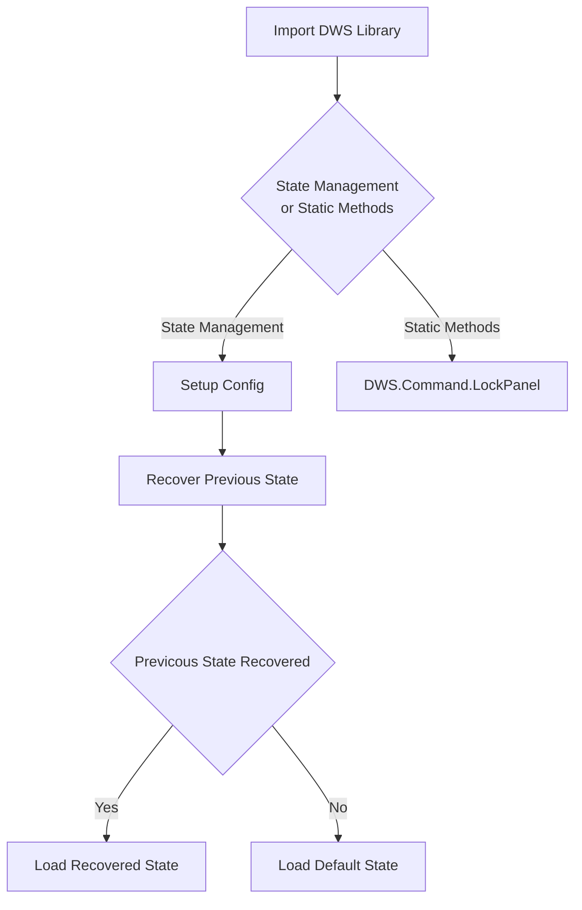

> [!WARNING]  
> This library is still in active development and not fully tested on all devices.

# Divisible Workspaces Library

The Divisible Workspace (DWS) Macro Library is a suite of tools provides commands and a state management features for handling combine and divide use cases for Cisco Collaboration Workspaces. 


## Overview

This library aims to provide tools specific to combine and divide use cases for Cisco Collaboration Devices.

Here are some of the features:

* Touch Panel Lock / Unlock:

    Easily Lock and Unlock the Touch Panel with a single command
    ```javascript
    import DWS from './DWS_Lib';

    // Lock the Touch Panel
    DWS.Command.LockPanel()
    
    // Unlock the Touch Panel
    DWS.Command.LockPanel()
    ```
* Persistent Do Not Disturb:

    Enable or disable a persistant Do Not Disturb state
    ```javascript
    import DWS from './DWS_Lib';

    // Activate Persistent Do Not Disturb
    DWS.Command.ActivateDND()
    
    // Deactivate Persistent Do Not Disturb
    DWS.Command.DeactivateDND()
    ```
* Ethernet Stream Mute:

    Mute and Unmute Ethernet Audio Input using just the stream name
    ```javascript
    import DWS from './DWS_Lib';

    // Mute Ethernet Audio Input with stream name 'myStream'
    DWS.Command.MuteEthernetMic('myStream')
    
    // Mute Ethernet Audio Input with stream name 'myStream'
    DWS.Command.UnmuteEthernetMic('myStream')
    ```


### Flow Diagram




## Setup

### Prerequisites & Dependencies: 

- RoomOS/CE 11.8 or above Webex Device
- Web admin access to the device to upload the macro
- Network connectivity between your Webex Devices so they can communicate and sync state changes


### Installation Steps:

1. Download the ``DWS_Lib.js`` and ``DWS_Config.js`` macro files and upload it to your Webex Room devices Macro editor via the web interface.
2. Configure the ``DWS_Config`` macro by specifying the Codecs involved in the divisible workspaces.
3. Don't enable the ``DWS_Lib`` and ``DWS_Config`` macros as these are expected to be imported into you own macro.


### Getting Started:

Refer to the ``DWS_Example``  macro which imports both the ``DWS_Lib`` and ``DWS_Config`` and demonstrates how to use the libraries state management and static methods features:

* State Management:

    ```javascript
    import xapi from 'xapi'
    import DWS from './DWS_Lib'
    import config from './DWS_Config'

    const states = {
        Primary: {
            Divided() {
                // Apply Primary Codec Divided changes here
            },
            Combined() {
                // Apply Primary Codec Combined changes here
            }
        },
        Secondary: {
            Divided() {
                // Apply Secondary Codec Divided changes here
            },
            Combined() {
                // Apply Primary Codec Combined changes here
            }
        }
    }

    init();
    async function init(){
      console.log('Setting up Divisible Workspaces Library with config and states');
      await DWS.Setup(config, states);
      console.log('Setup Complete');
      setTimeout(DWS.Command.ApplyState, 2000, 'Combined')
    }
    ```


* Static Methods:

    ```javascript
    import DWS from './DWS_Lib';

    // Lock the Touch Panel
    DWS.Command.LockPanel()
    
    // Unlock the Touch Panel
    DWS.Command.LockPanel()
    ```

## Demo

*For more demos & PoCs like this, check out our [Webex Labs site](https://collabtoolbox.cisco.com/webex-labs).

## License
All contents are licensed under the MIT license. Please see [license](LICENSE) for details.


## Disclaimer

Everything included is for demo and Proof of Concept purposes only. Use of the site is solely at your own risk. This site may contain links to third party content, which we do not warrant, endorse, or assume liability for. These demos are for Cisco Webex use cases, but are not Official Cisco Webex Branded demos.


## Questions
Please contact the WXSD team at [wxsd@external.cisco.com](mailto:wxsd@external.cisco.com?subject=divisible-workspaces-library) for questions. Or, if you're a Cisco internal employee, reach out to us on the Webex App via our bot (globalexpert@webex.bot). In the "Engagement Type" field, choose the "API/SDK Proof of Concept Integration Development" option to make sure you reach our team. 
